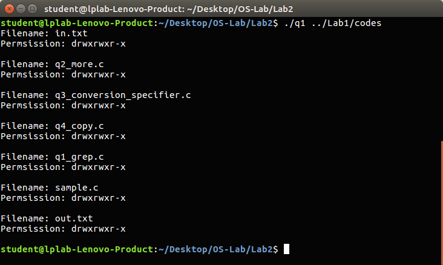
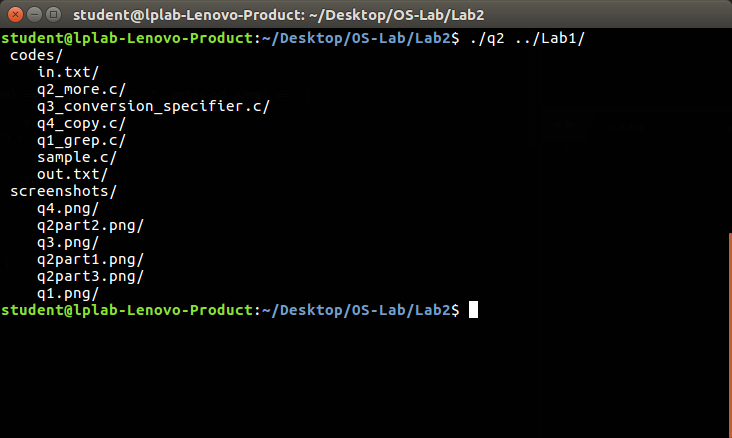
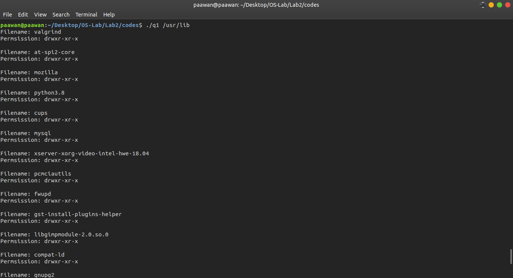
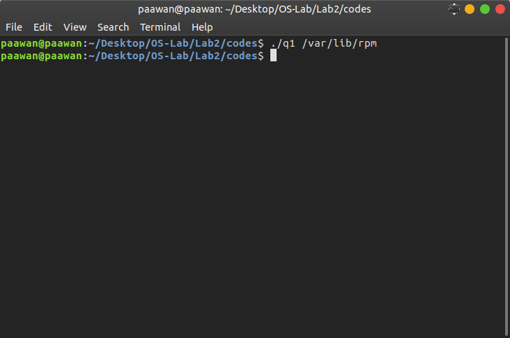

# OS Lab 2

##### Name: Paawan Kohli
##### Reg No: 180905416
##### Roll No: 52

### Q1. Write a C program to emulate the ls -l UNIX command that prints all files in a current directory and lists access privileges, etc. DO NOT simply exec ls -l from the program.

```
how to run: . / q1 path
```

```c
#include <unistd.h>
#include <sys/stat.h>
#include <sys/types.h>
#include <stdlib.h>
#include <stdio.h>
#include <dirent.h>
#include <string.h>

void main(int agrv, char ** arg) {
    DIR *mydir = opendir(arg[1]);

    struct dirent *myfile;
    struct stat fileStat;
    stat(".", &fileStat);

    while ((myfile = readdir(mydir)) != NULL) {
        stat(myfile->d_name, &fileStat);

        if (strcmp(".", myfile->d_name) == 0 || strcmp("..", myfile->d_name) == 0)
            continue;
        else {
            printf("Filename: %s\n", myfile->d_name);
            printf("Permsission: ");
            printf( (S_ISDIR(fileStat.st_mode)) ? "d" : "-");
            printf( (fileStat.st_mode & S_IRUSR) ? "r" : "-");
            printf( (fileStat.st_mode & S_IWUSR) ? "w" : "-");
            printf( (fileStat.st_mode & S_IXUSR) ? "x" : "-");
            printf( (fileStat.st_mode & S_IRGRP) ? "r" : "-");
            printf( (fileStat.st_mode & S_IWGRP) ? "w" : "-");
            printf( (fileStat.st_mode & S_IXGRP) ? "x" : "-");
            printf( (fileStat.st_mode & S_IROTH) ? "r" : "-");
            printf( (fileStat.st_mode & S_IWOTH) ? "w" : "-");
            printf( (fileStat.st_mode & S_IXOTH) ? "x" : "-");
            printf("\n\n");
        }
    }

    closedir(mydir);
}
```

</br>


### Q2. Write a program that will list all files in a current directory and all files in subsequent subdirectories (like tree)

```
how to run: ./q2 path
```

```c
#include <unistd.h>
#include <sys/stat.h>
#include <stdlib.h>
#include <stdio.h>
#include <string.h>
#include <dirent.h>

void printSpace(int depth) {
	for (int i = 0 ; i < depth ; i++) {
		printf("    ");
	}
}

void printRecurrsive(char *dir, int depth) {

	DIR* fd = opendir(dir);

	if (fd == NULL) {
		fprintf(stderr, "Error! Can't open %s\n", dir);
		exit(0);
	}

	chdir(dir);

	struct dirent* entry;
	struct stat buffer;

	while ((entry = readdir(fd)) != NULL) {
		lstat(entry->d_name, &buffer);

		if (S_ISDIR(buffer.st_mode)) {

			if (strcmp(".", entry->d_name) == 0 || strcmp("..", entry->d_name) == 0) {
				continue;
			}

			// print
			printSpace(depth);
			printf("%s \n", entry->d_name);
			
			printRecurrsive(entry->d_name, depth + 1);
		}
		else {

			// print
			printSpace(depth);
			printf("%s \n", entry->d_name);
		}
	}

	chdir("..");
	closedir(fd);
}

void main(int argv, char** arg) {

	// must have path
	if (argv != 2) {
		printf("Invalid syntax.\nFormat: ./q2 path \n");
		exit(0);
	}

	printRecurrsive(arg[1], 0);
}
```

</br>

### Q3. How do you list all installed programs in Linux?

```bash
./q1 usr/lib
```

</br>

### Q4. How do you find out what RPM packages are installed on Linux?

```bash
./q1 /var/lib/rpm
```

</br>