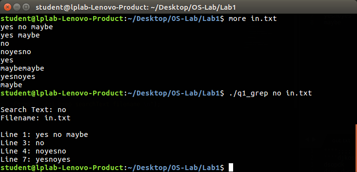
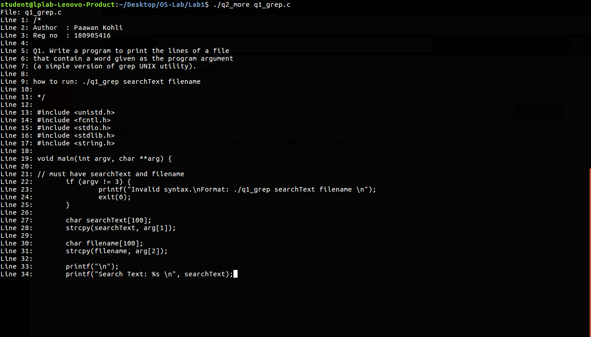
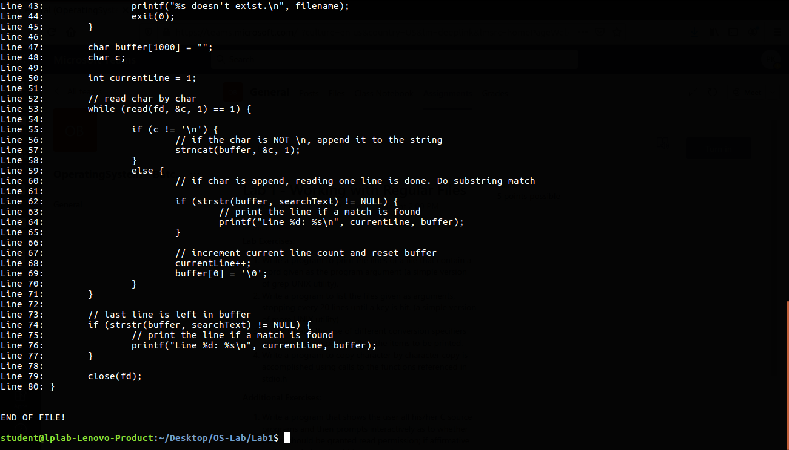
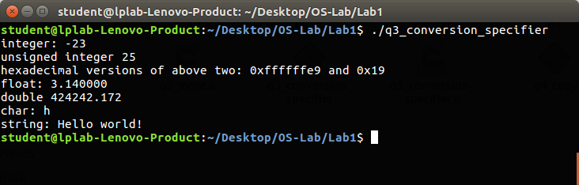
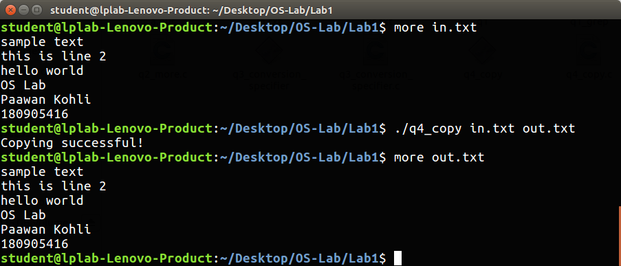

# OS Lab 1

##### Name: Paawan Kohli
##### Reg No: 180905416
##### Roll No: 52

### Q1. Write a program to print the lines of a file that contains a word given as the program argument (a simple version of grep UNIX utility).

```
how to run: . / q1_grep searchText filename
```

```c
#include <unistd.h>
#include <fcntl.h>
#include <stdio.h>
#include <stdlib.h>
#include <string.h>

void main(int argv, char **arg) {

	// must have searchText and filename
	if (argv != 3) {
		printf("Invalid syntax.\nFormat: ./q1_grep searchText filename \n");
		exit(0);
	}

	char searchText[100];
	strcpy(searchText, arg[1]);

	char filename[100];
	strcpy(filename, arg[2]);

	printf("\n");
	printf("Search Text: %s \n", searchText);
	printf("Filename: %s \n", filename);
	printf("\n");

	// open file
	int fd = open(filename, O_RDONLY);

	// check if file exists
	if (fd == -1) {
		printf("%s doesn't exist.\n", filename);
		exit(0);
	}

	char buffer[1000] = "";
	char c;

	int currentLine = 1;

	// read char by char
	while (read(fd, &c, 1) == 1) {

		if (c != '\n') {
			// if the char is NOT \n, append it to the string
			strncat(buffer, &c, 1);
		}
		else {
			// if char is append, reading one line is done. Do substring match

			if (strstr(buffer, searchText) != NULL) {
				// print the line if a match is found
				printf("Line %d: %s\n", currentLine, buffer);
			}

			// increment current line count and reset buffer
			currentLine++;
			buffer[0] = '\0';
		}
	}

	// last line is left in buffer
	if (strstr(buffer, searchText) != NULL) {
		// print the line if a match is found
		printf("Line %d: %s\n", currentLine, buffer);
	}

	close(fd);
}
```

</br>


### Q2. Write a program to list the files given as arguments, stopping every 20 buffers until a key is hit (a simple version of more UNIX utility)

```
how to run: ./q2_more filename
```

```c
#include <unistd.h>
#include <fcntl.h>
#include <stdio.h>
#include <stdlib.h>
#include <string.h>

void main (int argv, char **arg) {

	// must have filename
	if (argv != 2) {
		printf("Invalid syntax.\nFormat: ./q2_more filename \n");
		exit(0);
	}

	char filename[100];
	strcpy(filename, arg[1]);

	printf("File: %s\n", filename);

	int fd = open(filename, O_RDONLY);

	// check if file exists
	if (fd == -1) {
		printf("%s doesn't exist.\n", filename);
		exit(0);
	}

	char buffer[1000] = "";
	char c;
	int currentLine = 1;

	while (read(fd, &c, 1) == 1 && currentLine <= 20) {
		if (c != '\n') {
			strncat(buffer, &c, 1);
		} else {
			printf("Line %d: %s", currentLine, buffer);
			
			if (currentLine != 20) {
				printf("\n");
			}
			
			buffer[0] = '\0';
			currentLine++;
		}
	}

	while (read(fd, &c, 1) == 1) {
		if (c != '\n') {
			strncat(buffer, &c, 1);
		} else {
			// wait for key press before printing
			char keyPress = getchar();
			// read(0, &keyPress, 1);

			printf("Line %d: %s", currentLine, buffer);
			buffer[0] = '\0';
			currentLine++;
		}
	}

	// last line is left in buffer
	char keyPress = getchar();
	// read(0, &keyPress, 1);
	printf("Line %d: %s\n", currentLine, buffer);

	close(fd);

	printf("\n\nEND OF FILE!\n\n");
}
```


</br></br>
</br></br>
</br></br>

### Q3. Demonstrate  the use of different conversion specifiers and resulting output to allow the items to be printed.

```c
#include <stdio.h>

void main() {
	int x = -23;
	printf("integer: %d\n", x);

	unsigned int y = 25;
	printf("unsigned integer %u\n", y);

	printf("hexadecimal versions of above two: %#x and %#x\n", x, y);

	float z = 3.14;
	printf("float: %f\n", z);

	double d = 424242.171717;
	printf("double %3.3lf\n", d);


	char c = 'h';
	printf("char: %c\n", c);

	char str[] = "Hello world!";
	printf("string: %s\n", str);
}
```

</br>

### Q4. Write a program to copy character by character copy is accomplished using calls to the functions referenced in stdio.h

```
how to run: ./q4_copy sourceFilename destinationFilename
```

```c
#include <unistd.h>
#include <fcntl.h>
#include <stdio.h>
#include <stdlib.h>
#include <string.h>

void main(int argv, char ** arg) {

	// must have searchText and filename
	if (argv != 3) {
		printf("Invalid syntax.\nFormat: ./q4_copy sourceFilename destinationFilename \n");
		exit(0);
	}

	char srcFile[100], dstFile[100];
	strcpy(srcFile, arg[1]);
	strcpy(dstFile, arg[2]);

	FILE* in = fopen(srcFile, "r");
	FILE* out = fopen(dstFile, "w");

	char c;

	while ( (c = fgetc(in)) != EOF) {
		fputc(c, out);
	}

	fclose(in);
	fclose(out);

	printf("Copying successful!\n");
}

```

</br>