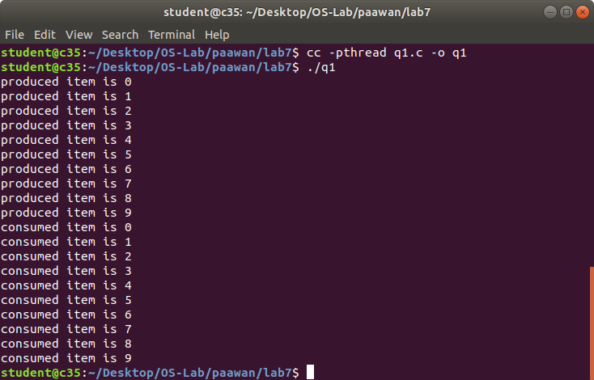
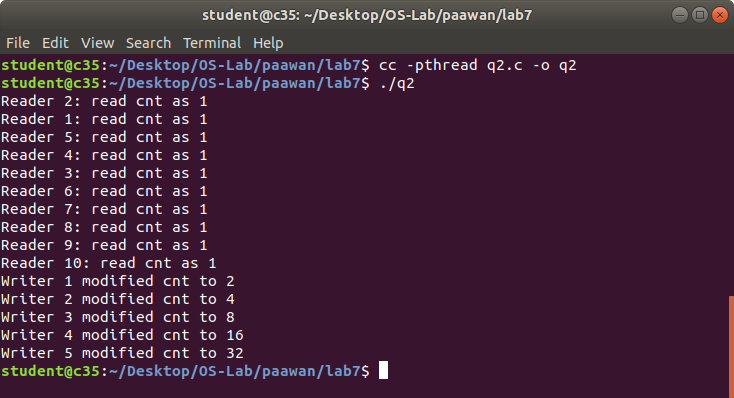
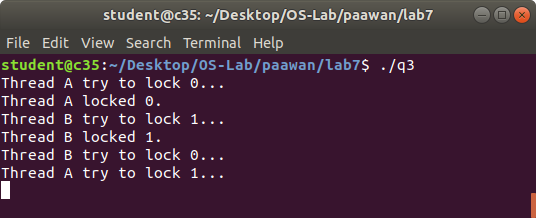
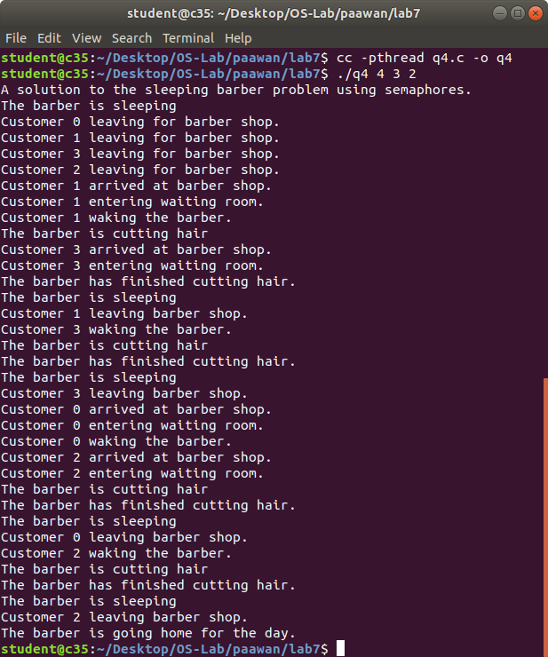

# OS LAB 7

### Name: Paawan Kohli
### Reg No: 180905416
### Roll No: 52

### Q1 Modify the above Producer-Consumer program so that, a producer can produce at the most 10 items more than what the consumer has consumed.

```c
#include <unistd.h>
#include <stdio.h>
#include <pthread.h>
#include <semaphore.h>

int buf[10], f, r;
sem_t mutex, full, empty;

void* produce(void *arg) {
	for (int i = 0; i < 10; i++) {
		sem_wait(&empty);
		sem_wait(&mutex);

		printf("produced item is %d\n", i);
		buf[(++r) % 10] = i;
		sleep(1);

		sem_post(&mutex);
		sem_post(&full);
	}
}

void* consume(void *arg) {
	for (int i = 0; i < 10; i++) {
		sem_wait(&full);
		sem_wait(&mutex);
	
		int item = buf[(++f) % 10];
		printf("consumed item is %d\n", item);
		sleep(1);

		sem_post(&mutex);
		sem_post(&empty);
	}
}

int main() {
	pthread_t tid1, tid2;

	sem_init(&mutex, 0, 1);
	sem_init(&full, 0, 0);
	sem_init(&empty, 0, 10);

	pthread_create(&tid1, NULL, produce, NULL);
	pthread_create(&tid2, NULL, consume, NULL);

	pthread_join(tid1, NULL);
	pthread_join(tid2, NULL);

	return 0;
}
```




### Q2 Write a C program for the first readers-writers problem using semaphores.

```c
#include <pthread.h>
#include <semaphore.h>
#include <stdio.h>

sem_t wrt;
pthread_mutex_t mutex;
int cnt = 1;
int numreader = 0;

void *writer(void *wno) {
	sem_wait(&wrt);
	
	cnt = cnt * 2;
	printf("Writer %d modified cnt to %d\n", (*((int *)wno)), cnt);
	
	sem_post(&wrt);
}

void *reader(void *rno) {
	pthread_mutex_lock(&mutex);
	numreader++;
	
	if (numreader == 1)
		sem_wait(&wrt);
	
	pthread_mutex_unlock(&mutex);
	


	printf("Reader %d: read cnt as %d\n", *((int *)rno), cnt);
	


	pthread_mutex_lock(&mutex);
	
	numreader--;
	
	if (numreader == 0)
		sem_post(&wrt);
	
	pthread_mutex_unlock(&mutex);
}

int main() {
	pthread_t read[10], write[5];
	pthread_mutex_init(&mutex, NULL);
	sem_init(&wrt, 0, 1);
	
	int a[10] = {1, 2, 3, 4, 5, 6, 7, 8, 9, 10};
	
	for (int i = 0; i < 10; i++)
		pthread_create(&read[i], NULL, (void *)reader, (void *)&a[i]);
	
	for (int i = 0; i < 5; i++)
		pthread_create(&write[i], NULL, (void *)writer, (void *)&a[i]);
	
	for (int i = 0; i < 10; i++)
		pthread_join(read[i], NULL);
	
	for (int i = 0; i < 5; i++)
		pthread_join(write[i], NULL);
	
	pthread_mutex_destroy(&mutex);
	sem_destroy(&wrt);
	
	return 0;
}
```




### Q3 Write a Code to  access  a shared resource which causes deadlock  using improper use of semaphore.
```c
#include <stdio.h>
#include <unistd.h>
#include <pthread.h>
#include <sys/sem.h>
#define PERMS 0660

int semId;

int initSem(int semId, int semNum, int initValue) {
	return semctl(semId, semNum, SETVAL, initValue);
}

int P(int semId, int semNum) {
	struct sembuf operationList[1];
	operationList[0].sem_num = semNum;
	operationList[0].sem_op = -1;
	operationList[0].sem_flg = 0;
	return semop(semId, operationList, 1);
}

int V(int semId, int semNum) {
	struct sembuf operationList[1];
	operationList[0].sem_num = semNum;
	operationList[0].sem_op = 1;
	operationList[0].sem_flg = 0;
	return semop(semId, operationList, 1);
}


void* funcA(void* nothing) {
	printf("Thread A try to lock 0...\n");
	P(semId, 0);
	printf("Thread A locked 0.\n");
	usleep(50 * 1000);
	printf("Thread A try to lock 1...\n");
	P(semId, 1);
	printf("Thread A locked 1.\n");
	V(semId, 0);
	V(semId, 1);
}


void* funcB(void* nothing) {
	printf("Thread B try to lock 1...\n");
	P(semId, 1);
	printf("Thread B locked 1.\n");
	usleep(5 * 1000);
	printf("Thread B try to lock 0...\n");
	P(semId, 0);
	printf("Thread B locked 0.\n");
	V(semId, 0);
	V(semId, 1);
}


int main(int argc, char* argv[]) {

	semId = semget(ftok(argv[0], 'A'), 2, IPC_CREAT | PERMS);
	initSem(semId, 0, 1);
	initSem(semId, 1, 1);

	pthread_t thread[2];
	pthread_create(&thread[0], NULL, funcA, NULL);
	pthread_create(&thread[1], NULL, funcB, NULL);
	
	for (int i = 0 ; i < 2 ; i++) {
		pthread_join(thread[i], NULL);
	}
	
	printf("This is not printed in case of deadlock\n");
	
	semctl(semId, 0, IPC_RMID, 0);
	semctl(semId, 1, IPC_RMID, 0);
	
	return 0;
}
```




### Q4 Write a program using semaphore to demonstrate the working of sleeping barber problem.

```c
#include <stdio.h>
#include <unistd.h>
#include <stdlib.h>
#include <pthread.h>
#include <semaphore.h>
#define MAX_CUSTOMERS 25

void *customer(void *num);
void *barber(void *);
void randwait(int secs);

sem_t waitingRoom;
sem_t barberChair;
sem_t barberPillow;
sem_t seatBelt;

int allDone = 0;

int main(int argc, char *argv[]) {
	pthread_t btid;
	pthread_t tid[MAX_CUSTOMERS];

	long RandSeed;
	int i, numCustomers, numChairs;
	int Number[MAX_CUSTOMERS];
	
	if (argc != 4) {
		printf("Use: SleepBarber <Num Customers> <Num Chairs> <rand seed>\n");
		exit(-1);
	}

	numCustomers = atoi(argv[1]);
	numChairs = atoi(argv[2]);
	RandSeed = atol(argv[3]);
	
	if (numCustomers > MAX_CUSTOMERS) {
		printf("The maximum number of Customers is %d.\n", MAX_CUSTOMERS);
		exit(-1);
	}

	printf("A solution to the sleeping barber problem using semaphores.\n");
	srand48(RandSeed);
	
	for (i = 0; i < MAX_CUSTOMERS; i++)
		Number[i] = i;
	
	sem_init(&waitingRoom, 0, numChairs);
	sem_init(&barberChair, 0, 1);
	sem_init(&barberPillow, 0, 0);
	sem_init(&seatBelt, 0, 0);
	
	pthread_create(&btid, NULL, barber, NULL);
	
	for (i = 0; i < numCustomers; i++)
		pthread_create(&tid[i], NULL, customer, (void *)&Number[i]);
	
	for (i = 0; i < numCustomers; i++)
		pthread_join(tid[i], NULL);
	
	allDone = 1;
	
	sem_post(&barberPillow);
	pthread_join(btid, NULL);
}

void* customer(void *number) {
	int num = *(int *)number;
	printf("Customer %d leaving for barber shop.\n", num);
	
	randwait(5);
	
	printf("Customer %d arrived at barber shop.\n", num);
	
	sem_wait(&waitingRoom);
	
	printf("Customer %d entering waiting room.\n", num);
	
	sem_wait(&barberChair);
	sem_post(&waitingRoom);
	
	printf("Customer %d waking the barber.\n", num);
	
	sem_post(&barberPillow);
	
	sem_wait(&seatBelt);
	sem_post(&barberChair);
	
	printf("Customer %d leaving barber shop.\n", num);
}

void* barber(void *junk) {
	while (!allDone) {
		
		printf("The barber is sleeping\n");
		sem_wait(&barberPillow);
		
		if (!allDone) {
			printf("The barber is cutting hair\n");
			randwait(3);
			printf("The barber has finished cutting hair.\n");
			sem_post(&seatBelt);
		} else {
			printf("The barber is going home for the day.\n");
		}
	}
}

void randwait(int secs) {
	int len;
	len = (int) ((drand48() * secs) + 1);
	sleep(len);
}
```

