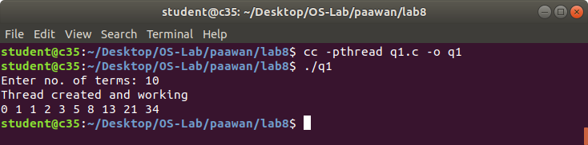
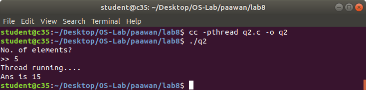
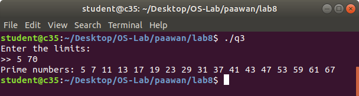
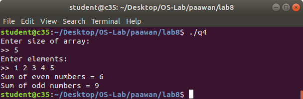

# OS LAB 8

### Name: Paawan Kohli
### Reg No: 180905416
### Roll No: 52

### Q1 Write a multithreaded program that generates the Fibonacci series. The program should work as follows: The user will enter on the command line the number of Fibonacci numbers that the program is to generate. The program then will create a separate thread that will generate the Fibonacci numbers, placing the sequence in data that is shared by the threads (an array is probably the most convenient data structure). When the thread finishes execution the parent will output the sequence generated by the child thread. Because the parent thread cannot begin outputting the Fibonacci sequence until the child thread finishes, this will require having the parent thread wait for the child thread to finish.

```c
#include <stdlib.h>
#include <stdio.h>
#include <pthread.h>
#include <string.h>

void *thread_code(void* param) {
	int n = *((int*)param);

	int arr[n];
	arr[0] = 0;
	arr[1] = 1;

	for (int i = 2; i < n; i++)
		arr[i] = arr[i - 2] + arr[i - 1];

	int *sol = (int *)calloc(n, sizeof(int));
	memcpy(sol, arr, sizeof(int) * n);

	return sol;
}


void main() {
	pthread_t thread;

	int n;
	printf("Enter no. of terms: ");
	scanf("%d", &n);

	void *arr;
	pthread_create(&thread, 0, &thread_code, (void*)&n);
	
	printf("Thread created and working\n");
	pthread_join(thread, &arr);
	
	int *arr2 = arr;
	
	for (int i = 0; i < n; i++)
		printf("%d ", (int)arr2[i]);

	printf("\n");
}
```




### Q2 Write a multithreaded program that calculates the summation of non-negative integers in a separate thread and passes the result to the main thread.

```c
#include <stdlib.h>
#include <stdio.h>
#include <pthread.h>
#include <string.h>

void* thread_code(void* n) {
	printf("Thread running....\n");

	int sum = 0;
	int limit = *((int*)n);

	for (int i = 1; i <= limit; i++)
		sum += i;

	*((int*)n) = sum;
}

void main() {
	pthread_t thread;

	int n;
	printf("No. of elements?\n>> ");
	scanf("%d", &n);

	int ans;
	pthread_create(&thread, 0, &thread_code, (void*)&n);

	pthread_join(thread, NULL);
	printf("Ans is %d\n", n);
}
```




### Q3 Write a multithreaded program for generating prime numbers from a given starting number to the given ending number.
```c
#include <stdlib.h>
#include <stdio.h>
#include <pthread.h>
#include <string.h>

void *prime(void* arr) {
	int low = *((int*)arr);
	int high = *(((int*)(arr + sizeof(int))));


	printf("Prime numbers: ");

	for (int i = low; i <= high; i++) {
		int flag = 0;
		for (int j = 2; j <= i / 2; j++) {
			if ((i % j) == 0) {
				flag = 1;
				break;
			}
		}

		if (flag == 0)
			printf("%d ", i);
	}

	printf("\n");
}

int main() {
	pthread_t thread;

	printf("Enter the limits:\n>> ");
	int arr[2];
	scanf("%d %d", &arr[0], &arr[1]);

	pthread_create(&thread, 0, &prime, (void*)arr);

	pthread_join(thread, NULL);
}
```




### Q4 Write a multithreaded program that performs the sum of even numbers and odd numbers in an input array. Create a separate thread to perform the sum of even numbers and odd numbers. The parent thread has to wait until both the threads are done.

```c
#include <stdlib.h>
#include <stdio.h>
#include <pthread.h>
#include <string.h>

void *even(void *arr) {
	int *arr2 = (int*)arr;
	int size = arr2[0];
	
	int sum = 0;
	for (int i = 1; i <= size; i++) 
		if (arr2[i] % 2 == 0)
			sum += arr2[i];
	
	return (void*) sum;
}

void *odd(void *arr) {
	int *arr2 = (int*)arr;
	int size = arr2[0];
	int sum = 0;

	for (int i = 1; i <= size; i++)
		if (arr2[i] % 2 != 0)
			sum += arr2[i];

	return (void*) sum;
}

int main() {
	int n;
	printf("Enter size of array:\n>> ");
	scanf("%d", &n);

	int arr[n + 1];
	arr[0] = n;

	printf("Enter elements:\n>> ");

	for (int i = 1; i <= n; i++)
		scanf("%d", &arr[i]);

	pthread_t t1, t2;
	pthread_create(&t1, 0, &even, (void *)arr);
	pthread_create(&t2, 0, &odd, (void *)arr);

	int e, o;

	pthread_join(t1, (void*) &e);
	pthread_join(t2, (void*) &o);
	printf("Sum of even numbers = %d\n", (int)e);
	printf("Sum of odd numbers = %d\n", (int)o);
}
```

